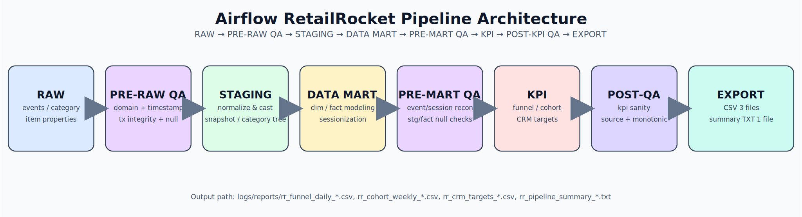

# DA-AIRFLOW_RETAILROCKET
RetailRocket clickstream으로 퍼널·코호트·CRM 타겟을 산출하는 Airflow 파이프라인입니다.  
지표 정의·세션 기준·품질 검증을 고정해 같은 데이터에서 같은 KPI가 나오도록 설계했습니다.  
결과는 일 단위로 계산되어 운영에 바로 쓰는 CSV/TXT로 저장됩니다.

## 현업 시나리오
월요일 아침 CVR 급락 알림(예: 2.4%→1.7%)이 오면 마케팅/상품/운영팀은 예산과 캠페인 중단 여부를 바로 논의합니다.  
이때 세션 기준 변경, 주문 식별값(`transaction_id`) 누락, 전환 정의 불일치가 겹치면 같은 로그에서도 팀마다 다른 결론이 나옵니다.  
이 프로젝트는 먼저 기준을 고정하고 품질 검증을 통과한 값만 퍼널·코호트·CRM으로 내보내도록 구성했습니다.

## 내가 본 리스크
- 세션 기준이 흔들리면 CVR 추세 해석이 바뀝니다.
- 주문 식별값(`transaction_id`) 무결성이 깨지면 구매/매출 지표가 과대·과소 추정될 수 있습니다.
- 배치 성공만 확인하면 도메인 오류·결측·중복이 KPI까지 전파됩니다.
- 지표 정의가 팀별로 다르면 같은 숫자도 다르게 해석됩니다.
- 전달 포맷이 없으면 분석 결과를 대시보드·캠페인 실행 입력으로 넘기기 어렵습니다.

## 내가 한 선택
- 분석용 테이블 단계에서 세션 기준(30분 비활동 + 날짜 변경)을 통일했습니다.
- 지표 정의(분자/분모)와 전처리/세션화 단계를 분리해 책임 경계를 명확히 했습니다.
- QA 5종(도메인/무결성/null/row count/KPI 범위)을 DAG에 넣어 품질 통과 후만 산출합니다.
- 퍼널·코호트·CRM 결과를 CSV 3종과 요약 TXT로 고정해 전달 형식을 단순화했습니다.
- Airflow 실행 시 `target_date`를 지정해 과거 날짜를 다시 계산(재현/검증)할 수 있게 했습니다.

## 결과
- QA를 통과한 경우에만 export 파일(CSV 3종 + 요약 TXT)이 생성됩니다.
- 실행 1회마다 동일 포맷의 산출물이 자동 생성됩니다.
- KPI 테이블과 품질 검증 쿼리를 분리해 원인 추적이 쉽도록 구성했습니다.

## Who this helps
- **BA/그로스**: 캠페인 성과 해석 전에 지표 정의와 세션 기준을 먼저 확인할 수 있습니다.
- **DQA/운영**: 배치 성공 여부가 아니라 KPI 신뢰 기준으로 파이프라인을 운영할 수 있습니다.

## Architecture



---

## Project Overview

| 단계 | 목적 | 설명(산출물) |
|---|---|---|
| RAW | 원본 로그를 보존해 추적 기준을 유지 | 원천 3개 테이블 적재: `raw_rr_events`, `raw_rr_item_properties`, `raw_rr_category_tree` |
| STAGING | 원천 로그를 분석 가능한 공통 포맷으로 표준화 | 이벤트 정규화 + 아이템 최신 스냅샷 + 카테고리 트리 평탄화: `stg_rr_events`, `stg_rr_item_snapshot`, `stg_rr_category_dim` |
| DATA MART | 분석 단위(fact/dim, 세션)를 고정 | 분석 테이블 5종 구성: `dim_rr_category`, `dim_rr_item`, `dim_rr_visitor`, `fact_rr_events`, `fact_rr_sessions` |
| KPI | 퍼널·코호트·CRM 정의를 계산 테이블로 분리 | KPI 테이블 4종 계산: `mart_rr_funnel_daily`, `mart_rr_funnel_category_daily`, `mart_rr_cohort_weekly`, `mart_rr_crm_targets_daily` |
| QA | 품질 기준 통과 여부를 실행 조건으로 적용 | 품질 결과 저장: `quality_check_runs` (`check_name`, `status`, `result_row_count`) |
| EXPORT | 운영 전달용 파일을 일관된 형식으로 생성 | 런타임 출력: `logs/reports/rr_*.{csv,txt}` / 포트폴리오 샘플: `docs/samples/outputs/` |

---

## Dataset

이 데이터는 clickstream 이벤트가 풍부해 세션화·퍼널·코호트·CRM 과정을 end-to-end로 검증하기 좋습니다.  
공개 데이터라 같은 파이프라인과 같은 지표를 재현 가능한 형태로 공유하기 적합합니다.

- 출처: Kaggle RetailRocket eCommerce Dataset  
  https://www.kaggle.com/datasets/retailrocket/ecommerce-dataset
- 로컬 경로: `data/raw/retailrocket/`
- 이벤트 기간: 2015-05-03 ~ 2015-09-18 (KST)

원본 파일:
- `events.csv` — `timestamp, visitorid, event, itemid, transactionid`
- `category_tree.csv` — `categoryid, parentid`
- `item_properties_part1.csv`, `item_properties_part2.csv` — `timestamp, itemid, property, value`

데이터 규모(로컬 기준):
- `events.csv`: 2,756,101행 (header 제외)
- `category_tree.csv`: 1,669행
- `item_properties_part1.csv`: 10,999,999행
- `item_properties_part2.csv`: 9,275,903행

EDA 요약 문서(클릭):
- [docs/retailrocket_eda.md](docs/retailrocket_eda.md)

EDA 재생성(스크립트):
- `python3 scripts/profile_retailrocket_eda.py`

핵심 관찰값(샘플 결과, 로컬 raw 데이터 기준):
- 이벤트 구성: `view` 96.67% / `addtocart` 2.52% / `transaction` 0.81%
- 퍼널 관찰(이벤트 기준): `addtocart/view=0.0260`, `transaction/addtocart=0.3239`
- 카테고리 트리: 노드 1,669개, 루트 25개, 리프 1,307개

---

## Modeling (요약/설계 의도)

- **STAGING**
  - 정의 기준:
    - 원천 로그를 그대로 추적할 수 있어야 함(컬럼 의미 불변)
    - 타입/포맷 변환은 여기서만 수행(시간, 문자열 정규화)
    - KPI 계산은 하지 않고, 분석 준비 상태까지만 책임
  - 구현:
    - `event_type` 정규화, `timestamp_ms`를 `event_ts/event_date`로 변환
    - 아이템 최신 속성(`categoryid`, `available`) 스냅샷 구성
    - 카테고리 트리를 재귀 CTE로 평탄화

- **DATA MART (분석용 fact/dim + 세션화)**
  - 정의 기준:
    - 분석 grain을 이벤트/세션 단위로 고정
    - 차원(dim)과 사실(fact)을 분리해 재사용성과 해석 일관성 확보
    - 세션 규칙을 SQL로 명시해 재현성 확보
  - Dimensions: `dim_rr_category`, `dim_rr_item`, `dim_rr_visitor`
  - Facts: `fact_rr_events`, `fact_rr_sessions`
  - 세션 규칙: 동일 `visitor_id` 첫 이벤트 / 날짜 변경 / 이전 이벤트 대비 30분 초과 비활동

- **KPI**
  - `mart_rr_funnel_daily`: 당일 퍼널 집계(방문자·세션·뷰·장바구니·구매, 3개 CVR)
  - `mart_rr_funnel_category_daily`: 카테고리별 퍼널 전환
  - `mart_rr_cohort_weekly`: 코호트 주차별 유지율(`active_visitors / cohort_size`)
  - `mart_rr_crm_targets_daily`: 실행 타겟 3세그먼트(`cart_abandoner_today`, `high_intent_viewer_7d_no_cart`, `repeat_buyer`)
  - 주요 전환식:
    - `cvr_session_to_purchase = sessions_with_purchase / sessions`
    - `cvr_view_to_cart = sessions_with_cart / sessions_with_view`
    - `cvr_cart_to_purchase = sessions_with_purchase / sessions_with_cart`

- **QA**
  - `001_domain_checks.sql`: 이벤트 타입이 `view/addtocart/transaction` 외 값인지 검사
  - `002_transaction_integrity.sql`: `transaction` 이벤트의 `transaction_id` 누락 검사
  - `003_null_checks.sql`: 핵심 키(`timestamp_ms`, `visitor_id`, `item_id`, `event_ts`) null 검사
  - `004_rowcount_sanity.sql`: `stg_rr_events`, `fact_rr_events`, `fact_rr_sessions` 비어있는지 검사
  - `005_kpi_sanity.sql`: 퍼널 집계 음수 및 CVR 범위(0~1) 이탈 검사

- **EXPORT**
  - `rr_funnel_daily_{date}.csv`
  - `rr_cohort_weekly_{date}.csv`
  - `rr_crm_targets_{date}.csv`
  - `rr_pipeline_summary_{date}.txt`

---

## Outputs

```text
docs/samples/outputs/rr_funnel_daily_2015-09-18.csv
docs/samples/outputs/rr_cohort_weekly_2015-09-18.csv
docs/samples/outputs/rr_crm_targets_2015-09-18.csv
docs/samples/outputs/rr_pipeline_summary_2015-09-18.txt
```

- 런타임 기본 출력 경로: `logs/reports/`

---

## Project Page

https://<your-github-username>.github.io/da-airflow-retailrocket/
