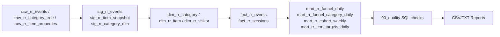

# DA-AIRFLOW_RETAILROCKET

Apache Airflow 기반 RetailRocket 포트폴리오 파이프라인입니다.  
`rr_funnel_daily` DAG가 `RAW -> STAGING -> MART -> KPI -> QA -> EXPORT`를 자동화합니다.

---

## 1) 원본 데이터( RAW )

소스 파일(`data/raw/retailrocket/`)

- `events.csv`: 사용자 이벤트 로그
  - `timestamp`, `visitorid`, `event`, `itemid`, `transactionid`
- `category_tree.csv`: 카테고리 계층
  - `categoryid`, `parentid`
- `item_properties_part1.csv`, `item_properties_part2.csv`: 상품 속성 이력
  - `timestamp`, `itemid`, `property`, `value`

---

## 2) 파이프라인 도식화



---

## 3) 레이어별 처리 설명

### 3-1. STAGING

**왜 이 레이어가 필요한가? (목적)**

- 원본 로그(`events.csv`)는 분석/집계에 바로 쓰기 어려운 형태(문자열/정규화 안됨/타임스탬프 ms)라서,
  **분석 친화적인 정형 구조로 재설계**하기 위해 STAGING을 둡니다.
- 원본의 “의미”는 최대한 보존하면서, 이후 MART/KPI에서 공통으로 재사용 가능한 중간 표준 레이어를 만듭니다.

**설계 기준**

- 원본 손상 없이 타입/포맷 표준화
- 변환 로직을 STAGING에 집중해 하위 레이어 단순화
- 중복 계산 제거(한 번 변환 후 다수 단계에서 재사용)

**핵심 키워드**

- `schema-on-write`
- `type normalization`
- `event canonicalization`
- `late-binding for analytics`

- `stg_rr_events`
  - `event_type` 정규화(`LOWER/TRIM`)
  - `timestamp_ms` -> `event_ts`, `event_date` 변환
- `stg_rr_item_snapshot`
  - `categoryid`, `available` 속성의 최신값만 추출(`ROW_NUMBER`)
- `stg_rr_category_dim`
  - 재귀 CTE로 카테고리 트리/루트/깊이/경로 생성

### 3-2. MART

**왜 이 레이어가 필요한가? (목적)**

- STAGING은 “정제된 원본”에 가깝고, MART는 “의사결정용 데이터 모델”입니다.
- 대시보드/분석에서 반복되는 조인·집계 비용을 줄이기 위해
  **차원/사실(Star Schema 성격) 기반으로 재구성**합니다.

**설계 기준**

- 차원(`dim_*`)과 사실(`fact_*`)을 분리해 해석성과 성능 확보
- 세션 단위 행동 분석 가능하도록 이벤트에 `session_id` 부여
- KPI 계산에 필요한 최소·명확한 엔터티로 분해

**핵심 키워드**

- `dimensional modeling`
- `star schema`
- `sessionization`
- `analytics-ready mart`

- 차원 테이블
  - `dim_rr_category`, `dim_rr_item`, `dim_rr_visitor`
- 사실 테이블
  - `fact_rr_events`: 세션 ID 부여
  - `fact_rr_sessions`: 세션 단위 집계

#### 세션 분리 규칙 (핵심)

`fact_rr_events` 생성 시 동일 visitor 기준으로 새 세션(`new_sess=1`) 처리:

1. 이전 이벤트가 없는 첫 이벤트
2. 날짜가 바뀐 경우
3. 이전 이벤트와의 간격이 30분 초과인 경우

세션 ID 형식: `visitor_id-session_index`

### 3-3. KPI

**왜 이 레이어가 필요한가? (목적)**

- MART는 범용 분석용이고, KPI는 비즈니스 의사결정용 지표를
  **즉시 사용 가능한 형태로 제품화**한 레이어입니다.
- 퍼널, 코호트, CRM 타겟을 분리해 목적별 소비(대시보드/캠페인/리포팅)를 명확히 합니다.

**설계 기준**

- 일자 기준 반복 계산 가능(재실행/백필 친화)
- 지표 정의를 SQL로 명시해 재현성과 검증성 확보
- 운영 활용 시나리오(마케팅 타겟팅)까지 연결

**핵심 키워드**

- `metric layer`
- `funnel analytics`
- `cohort retention`
- `CRM targeting`

- `mart_rr_funnel_daily`: 일 단위 funnel/전환율
- `mart_rr_funnel_category_daily`: 루트 카테고리별 funnel
- `mart_rr_cohort_weekly`: 구매 코호트 리텐션(주차)
- `mart_rr_crm_targets_daily`: CRM 타겟 세그먼트
  - 당일 장바구니 이탈
  - 최근 7일 고의도 뷰어(무카트)
  - 반복 구매자

### 3-4. QA

**왜 이 레이어가 필요한가? (목적)**

- ETL은 “실행 성공”과 “데이터 품질 보장”이 다르기 때문에,
  배치 완료 후 반드시 품질 게이트를 둬야 합니다.
- 지표 왜곡을 유발하는 도메인/널/무결성 이상을 조기 탐지합니다.

**설계 기준**

- SQL 기반 자동 검증(파이프라인에 내장)
- 실패 시 즉시 탐지 가능한 명시적 체크 항목
- 비즈니스 지표 범위(예: CVR 0~1) 검증 포함

**핵심 키워드**

- `data quality gate`
- `assertion query`
- `sanity check`
- `data reliability`

`sql/retailrocket/90_quality/`에서 품질 검증:

- 이벤트 도메인 체크
- transaction 무결성 체크
- null 체크
- 핵심 테이블 row count sanity
- KPI 값 범위 sanity (CVR 0~1 등)

### 3-5. EXPORT

**왜 이 레이어가 필요한가? (목적)**

- 최종 사용자/포트폴리오 검증 관점에서는 DB 내부 테이블보다
  **즉시 전달 가능한 산출물(CSV/TXT)** 이 중요합니다.
- 분석 결과를 외부 도구(스프레드시트, BI, 문서)와 쉽게 연동합니다.

**설계 기준**

- 날짜별 파일명으로 재현성/추적성 확보
- 요약 리포트(txt)와 상세 지표(csv) 병행 제공

**핵심 키워드**

- `data product`
- `delivery artifact`
- `reproducible output`

성공 시 `logs/reports/` 산출물 생성:

- `rr_funnel_daily_<target_date>.csv`
- `rr_cohort_weekly_<target_date>.csv`
- `rr_crm_targets_<target_date>.csv`
- `rr_pipeline_summary_<target_date>.txt`

---

## 4) DAG 정보

- DAG ID: `rr_funnel_daily`
- Schedule: `0 9 * * *` (Asia/Seoul)
- `catchup=False` (대량 자동 백필 방지)
- `max_active_runs=1`
- 수동 백필: `dag_run.conf.target_date` 지원

---

## 5) 실행 방법

### 5-1. 컨테이너 기동

```bash
make up
```

### 5-2. DDL 초기화

```bash
make init
```

### 5-3. DAG 실행

```bash
make run-dag
```

### 5-4. 특정 날짜 백필

```bash
docker compose exec -T airflow-apiserver \
  airflow dags trigger rr_funnel_daily \
  -r manual_backfill_2015-09-18 \
  -c '{"target_date":"2015-09-18"}'
```

### 5-5. 실행 상태 확인

```bash
docker compose exec -T airflow-apiserver airflow dags list-runs rr_funnel_daily -o table
docker compose exec -T airflow-apiserver airflow tasks states-for-dag-run rr_funnel_daily <run_id>
```

---

## 6) GitHub 업로드 가이드

### 커밋 권장

- `dags/`, `scripts/`, `sql/`
- `docker-compose.yml`, `Dockerfile`, `Makefile`, `requirements.txt`
- `README.md`, `.env.example`

### 커밋 제외

- `.env` 및 민감정보
- `logs/`, `exports/`, `.omx/`
- 대용량 원본데이터(`data/raw/`)
