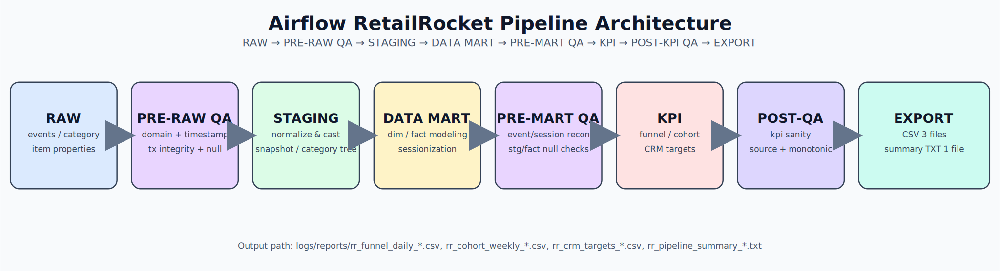

# RetailRocket 행동로그 정합성 게이트 기반 KPI 파이프라인
RetailRocket clickstream으로 **퍼널·코호트·CRM 타겟**을 산출하는 Airflow 파이프라인입니다.  
핵심은 배치 성공이 아니라, **KPI 이전 행동로그 정합성 게이트 + KPI 이후 원천-지표 일치 검증**을 고정해 같은 데이터에서 같은 KPI가 나오게 만드는 것입니다.

## 1) 문제와 목표
CVR 급락 알림이 오면 보통 캠페인/예산 조정을 먼저 논의합니다.  
하지만 세션 기준, 전환 정의, `transaction_id` 무결성이 흔들리면 같은 로그에서도 결론이 달라질 수 있습니다.

핵심 리스크:
- 세션 기준 변화로 CVR 해석이 달라질 수 있음
- `transaction_id` 누락/중복으로 구매·매출 지표 왜곡 가능
- 배치 성공만으로는 도메인 오류·결측·중복 전파를 막기 어려움
- 결과를 실행 형식(타겟 리스트/요약 리포트)으로 정리하지 않으면 후속 액션이 지연될 수 있음

프로젝트 목표는 위 리스크를 줄이기 위해  
**지표 정의·세션 기준·품질 검증을 고정하고, QA를 통과한 결과만 운영 산출물로 전달하는 파이프라인을 구축하는 것**입니다.

## 2) 데이터셋
이 데이터는 clickstream 이벤트가 풍부해 세션화·퍼널·코호트·CRM 과정을 end-to-end로 검증하기 적합합니다.  
공개 데이터라 재현 가능한 형태로 분석 결과를 공유하기 좋습니다.

- 출처: Kaggle RetailRocket eCommerce Dataset  
  https://www.kaggle.com/datasets/retailrocket/ecommerce-dataset
- 로컬 경로: `data/raw/retailrocket/`
- 이벤트 기간: 2015-05-03 ~ 2015-09-18 (KST)

데이터 규모(로컬 기준):

| 파일 | 규모 (행 × 열) | 주요 컬럼 |
|---|---:|---|
| `events.csv` | 2,756,101 × 5 | `timestamp, visitorid, event, itemid, transactionid` |
| `category_tree.csv` | 1,669 × 2 | `categoryid, parentid` |
| `item_properties_part1.csv` | 10,999,999 × 4 | `timestamp, itemid, property, value` |
| `item_properties_part2.csv` | 9,275,903 × 4 | `timestamp, itemid, property, value` |

EDA 참고:
- 요약 문서: [docs/retailrocket_eda.md](docs/retailrocket_eda.md)
- 재생성 스크립트: `python3 scripts/profile_retailrocket_eda.py`

## 3) 파이프라인 설계와 구현


| 단계 | 목적 | 이 단계에서 한 일 |
|---|---|---|
| RAW | 원본 보존과 추적 기준 확보 | CSV 원본을 그대로 적재해 원천 로그를 보존하고, 이후 단계와 분리해 재처리 기준을 고정 |
| PRE-RAW QA | STAGING 전 원천 정합성 선검증 | 원천 도메인/트랜잭션 무결성/핵심 null 체크를 통과한 실행만 STAGING 진행 |
| STAGING | 전처리 편차 제거 | 이벤트 타입 정규화, 시간 변환(`timestamp_ms → event_ts/event_date`), 아이템 최신 속성 스냅샷, 카테고리 트리 평탄화 |
| DATA MART | 분석 단위 통일 | dim/fact 구조로 분리하고 세션 규칙(30분 inactivity + 날짜 변경)을 SQL로 고정 |
| PRE-MART QA | KPI 산출 직전 마트 정합성 검증 | event/session 일치 + stg/fact null 체크를 통과한 실행만 KPI 계산 진행 |
| KPI | 지표 계산 일관성 확보 | Funnel/Cohort/CRM 계산을 별도 테이블로 분리해 분자/분모 정의를 단일화 |
| POST-QA | KPI 산출 후 결과 검증 | KPI sanity + source 일치 + monotonic 검증을 통과한 실행만 export 허용 |
| EXPORT | 실행 가능한 전달물 생성 | PRE/POST QA 게이트 통과 시에만 CSV 3종 + summary TXT 1종을 고정 파일명 패턴으로 생성 |

<details>
<summary><strong>워크플로우 전체 상세 보기 (RAW → PRE-RAW QA → STAGING → DATA MART → PRE-MART QA → KPI → POST-KPI QA → EXPORT)</strong></summary>

### 1) RAW — 원본을 “훼손 없이” 보존
- **왜 필요한가**: 원본이 바뀌면 원인 추적이 불가능해집니다. 재현 가능한 분석의 출발점은 원본 보존입니다.
- **어떻게 했나**: `events.csv`, `item_properties*.csv`, `category_tree.csv`를 그대로 적재하고 이후 레이어(STAGING/MART)와 분리했습니다.
- **관련 코드**
  - 적재 스크립트: `scripts/load_raw/load_retailrocket.py`
  - 테이블 정의: [`001_create_tables.sql`](sql/retailrocket/00_ddl/001_create_tables.sql)

### 2) PRE-RAW QA — STAGING 전 원천 정합성 게이트
- **왜 필요한가**: raw 단계에서 깨진 데이터가 들어오면 STAGING부터 왜곡이 전파됩니다.
- **어떻게 했나**: RAW 직후 PRE-RAW 게이트를 실행해 통과한 경우에만 STAGING으로 진행합니다.

| 체크 | 무엇을 막는가 | 실패 조건 (설명형) | SQL |
|---|---|---|---|
| Domain + timestamp | 허용되지 않은 이벤트 타입/비정상 timestamp 유입 | `event_type`이 허용값(`view/addtocart/transaction`) 밖이거나 공백/NULL이면, 이벤트 분류 기준이 깨졌다고 판단해 실패 | [`001_domain_timestamp_checks.sql`](sql/retailrocket/90_quality_pre_raw/001_domain_timestamp_checks.sql) |
| Transaction integrity | 구매/비구매 이벤트 식별 불일치 | transaction 이벤트인데 `transaction_id`가 비어 있거나, non-transaction 이벤트에 `transaction_id`가 들어오거나, 하나의 `transaction_id`가 여러 visitor에 매핑되면 실패 | [`002_transaction_integrity.sql`](sql/retailrocket/90_quality_pre_raw/002_transaction_integrity.sql) |
| Raw null checks | 원천 핵심 컬럼 결측 전파 | `timestamp_ms`, `visitor_id`, `event_type`, `item_id` 중 하나라도 NULL이면 세션화/집계 전제 자체가 깨졌다고 보고 실패 | [`003_null_checks.sql`](sql/retailrocket/90_quality_pre_raw/003_null_checks.sql) |

### 3) STAGING — 분석 전에 “형식”을 먼저 통일
- **왜 필요한가**: 원본 로그는 타입/시간/속성 포맷이 제각각이라 바로 집계하면 팀마다 다른 결과가 나옵니다.
- **어떻게 했나**
  - 이벤트 타입을 허용값(`view/addtocart/transaction`) 기준으로 정규화
  - `timestamp_ms`를 사람이 해석 가능한 `event_ts`, 집계용 `event_date`로 변환
  - item property를 최신 값 기준으로 스냅샷화(조인 안정화)
  - 카테고리 트리를 평탄화해 차원 조인 비용 축소
- **관련 SQL**
  - [`001_stg_rr_events.sql`](sql/retailrocket/10_staging/001_stg_rr_events.sql)
  - [`002_stg_rr_item_snapshot.sql`](sql/retailrocket/10_staging/002_stg_rr_item_snapshot.sql)
  - [`003_stg_rr_category_dim.sql`](sql/retailrocket/10_staging/003_stg_rr_category_dim.sql)

### 4) DATA MART — 분석 단위를 세션/팩트 중심으로 고정
- **왜 필요한가**: 같은 이벤트라도 “세션을 어떻게 자르느냐”에 따라 CVR이 달라집니다.
- **어떻게 했나**
  - visitor별 시간순 정렬 후 세션 경계 규칙을 SQL로 고정
  - 새 세션 시작 조건: (1) 첫 이벤트, (2) 날짜 변경, (3) 이전 이벤트와 30분 초과 간격
  - 세션 ID(`visitor_id-session_index`) 생성 후 세션 단위 집계 테이블 구성
- **관련 SQL**
  - 이벤트 세션화: [`010_fact_rr_events.sql`](sql/retailrocket/20_mart/010_fact_rr_events.sql)
  - 세션 집계: [`020_fact_rr_sessions.sql`](sql/retailrocket/20_mart/020_fact_rr_sessions.sql)

### 5) PRE-MART QA — KPI 직전 마트 정합성 게이트
- **왜 필요한가**: STAGING/MART를 거친 집계 단위가 틀리면 KPI 계산이 맞아도 해석이 틀립니다.
- **어떻게 했나**: DATA MART 이후 PRE-MART 게이트를 실행해 통과한 경우에만 KPI 계산으로 진행합니다.

| 체크 | 무엇을 막는가 | 실패 조건 (설명형) | SQL |
|---|---|---|---|
| Count reconciliation | raw→stg→fact 행수 불일치 전파 | 같은 `target_date` 기준 이벤트 건수가 raw/stg/fact 사이에서 다르면, 변환·조인 과정에서 유실/중복이 생긴 것으로 보고 실패 | [`001_event_count_reconciliation.sql`](sql/retailrocket/91_quality_pre_mart/001_event_count_reconciliation.sql) |
| Session reconciliation | 세션 집계 기준 불일치 | `fact_rr_sessions`의 세션 수와 `fact_rr_events`에서 집계한 distinct session 수가 다르면 세션화 규칙 적용 불일치로 보고 실패 | [`002_session_count_reconciliation.sql`](sql/retailrocket/91_quality_pre_mart/002_session_count_reconciliation.sql) |
| Stg/Fact null checks | 핵심 키 결측으로 인한 KPI 왜곡 | `event_ts`, `session_id` 같은 분석 핵심 키가 NULL이면 KPI 분자/분모 왜곡 가능성이 높아 실패 | [`003_null_checks.sql`](sql/retailrocket/91_quality_pre_mart/003_null_checks.sql) |

### 6) KPI — “숫자”가 아니라 “정의”를 고정
- **왜 필요한가**: KPI는 값보다 정의가 중요합니다. 분자/분모가 흔들리면 비교 자체가 무의미해집니다.
- **어떻게 했나**
  - **Funnel(일 단위)**: “그 날짜에 생성된 세션 중 어디까지 진행했는가”를 비율로 계산
    - 예) `cvr_session_to_purchase = sessions_with_purchase / sessions`
  - **Cohort(주 단위)**: “첫 구매 주차별 사용자군이 다음 주에도 돌아오는가”를 유지율로 계산
    - 예) `retention_rate = active_visitors / cohort_size`
  - **CRM Targets(일 단위)**: “오늘 액션 가능한 대상”을 규칙 기반 세그먼트로 생성
    - 장바구니 이탈자, 고의도 조회자(7일), 반복구매자
- **관련 SQL**
  - Funnel: [`001_mart_rr_funnel_daily.sql`](sql/retailrocket/30_kpi/001_mart_rr_funnel_daily.sql)
  - Cohort: [`003_mart_rr_cohort_weekly.sql`](sql/retailrocket/30_kpi/003_mart_rr_cohort_weekly.sql)
  - CRM: [`004_mart_rr_crm_targets_daily.sql`](sql/retailrocket/30_kpi/004_mart_rr_crm_targets_daily.sql)

### 7) POST-QA — KPI 이후 결과 검증 게이트
- **왜 필요한가**: KPI가 계산됐더라도 값의 일관성/원천-지표 일치 검증이 안 되면 운영 전달물 신뢰가 떨어집니다.
- **어떻게 했나**: KPI 계산 후 범위 sanity + source 일치 + monotonic 규칙을 검증했습니다.

| 체크 | 무엇을 막는가 | 실패 조건 (설명형) | SQL |
|---|---|---|---|
| KPI sanity | 비정상 KPI 수치 배포 | KPI 값이 음수이거나 CVR이 0~1 범위를 벗어나면 계산식/분모 처리 이상으로 판단해 실패 | [`001_kpi_sanity.sql`](sql/retailrocket/95_quality_post_kpi/001_kpi_sanity.sql) |
| Funnel 일치 + monotonic | KPI 집계 오차/퍼널 역전 배포 | source 대비 KPI 집계값이 다르거나 `purchase<=cart<=view`/세션 퍼널 단조성이 깨지면 실패 | [`002_funnel_reconciliation_monotonic.sql`](sql/retailrocket/95_quality_post_kpi/002_funnel_reconciliation_monotonic.sql) |

실제로 `scripts/run_quality_checks.py`는 각 게이트에서 하나라도 FAIL이면 비정상 종료(`exit 1`)되며, 이 때문에 PRE/POST QA 통과 전에는 CSV/TXT export가 실행되지 않습니다.

### 8) EXPORT — 운영팀이 바로 쓸 수 있는 형태로 마감
- **왜 필요한가**: 분석 결과를 실행 포맷으로 전달하지 않으면 후속 액션이 지연됩니다.
- **어떻게 했나**
  - PRE/POST QA 게이트 통과 실행에서만 CSV/TXT를 생성
  - 파일명 규칙 고정(`rr_funnel_daily_*`, `rr_cohort_weekly_*`, `rr_crm_targets_*`, `rr_pipeline_summary_*`)
- **관련 스크립트**
  - [`export_rr_funnel_csv.py`](scripts/export_rr_funnel_csv.py)
  - [`export_rr_cohort_csv.py`](scripts/export_rr_cohort_csv.py)
  - [`export_rr_crm_targets_csv.py`](scripts/export_rr_crm_targets_csv.py)
  - [`write_rr_pipeline_summary.py`](scripts/write_rr_pipeline_summary.py)

</details>

## 4) 결과와 산출물
실행 기준 안내(중요):
- RetailRocket 원천 이벤트 기간은 `2015-05-03 ~ 2015-09-18`입니다.
- 따라서 **오늘 날짜(예: 2026-03-02)** 로 실행하면 KPI가 0으로 나올 수 있습니다.
- 포트폴리오 재현은 반드시 **backfill target_date**로 실행합니다.

백필 실행 예시:
```bash
# make 타겟 (기본: 2015-06-16)
make run-dag-backfill

# 날짜 변경 예시
make run-dag-backfill PORTFOLIO_TARGET_DATE=2015-09-18

# Airflow DAG trigger (권장)
docker compose exec airflow-apiserver \
  airflow dags trigger rr_funnel_daily \
  --conf '{"target_date":"2015-06-16"}'

# 또는 스크립트 직접 실행
docker compose exec airflow-apiserver \
  bash -lc "cd /opt/airflow/project && bash ./scripts/run_pipeline_linux_rr.sh 2015-06-16"
```

대표 재현 실행: `target_date=2015-06-16`

결과 요약:
- QA 통과 실행에서만 export 생성
- 실행 1회마다 동일 포맷 산출물 자동 생성
- KPI 계산 로직과 품질 검증 로직 분리로 원인 추적 단순화

산출물(샘플):

| 파일 | 샘플 크기 | 용도 |
|---|---:|---|
| `rr_funnel_daily_2015-06-16.csv` | 1행 | 일자 퍼널·CVR 해석 |
| `rr_cohort_weekly_2015-06-16.csv` | 6행 | 주차별 유지율 확인 |
| `rr_crm_targets_2015-06-16.csv` | 312행 | CRM 실행 타겟 전달 |
| `rr_pipeline_summary_2015-06-16.txt` | 23줄 | 실행/품질 요약 검수 |

핵심 수치(2015-06-16):
- Funnel: visitors `4,379`, sessions `4,540`, purchases `67`, `cvr_session_to_purchase=0.0134`
- CRM 분포: `cart_abandoner_today=80`, `high_intent_viewer_7d_no_cart=115`, `repeat_buyer=117`
- QA: PRE-RAW / PRE-MART / POST-KPI 체크 모두 `PASS`

산출물 경로:
- 런타임 출력: `logs/reports/`
- 포트폴리오 샘플: `docs/samples/outputs/`

링크:
- GitHub Repo: https://github.com/GeonYul2/DA-AIRFLOW_RETAILROCKET
- README: https://github.com/GeonYul2/DA-AIRFLOW_RETAILROCKET/blob/main/README.md
