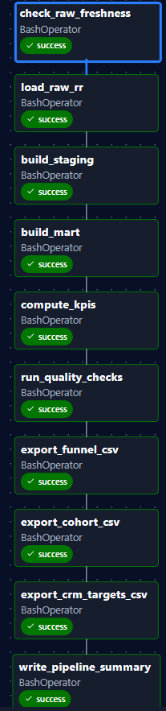
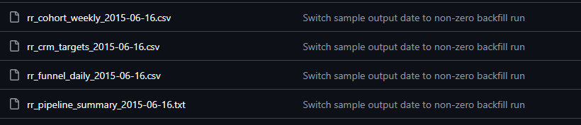
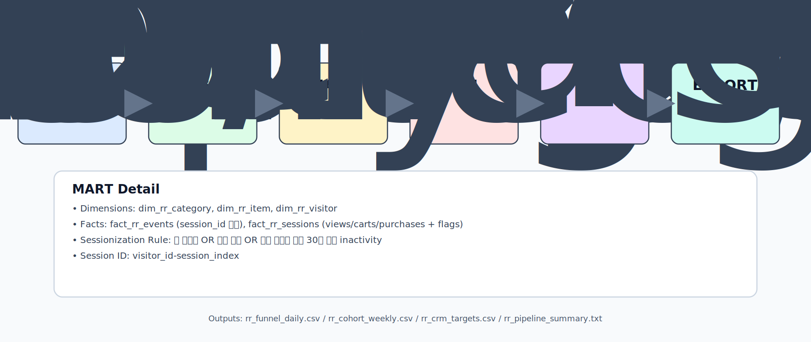

# DA-AIRFLOW_RETAILROCKET

RetailRocket clickstream으로 **퍼널·코호트·CRM 타겟**을 산출한 Airflow 파이프라인입니다.  
지표 정의, 세션 기준, QA 기준을 고정해 같은 데이터에서 같은 KPI가 나오도록 설계했습니다.  
결과는 운영 전달용 **CSV 3종 + summary TXT 1종**으로 생성됩니다.

[Source Code](https://github.com/GeonYul2/DA-AIRFLOW_RETAILROCKET) · [Runbook](runbook.md)

## 현업 시나리오
CVR 급락 알림이 오면 보통 캠페인/예산 조정부터 검토합니다.  
하지만 세션 기준 변경, 전환 정의 차이, `transaction_id` 누락이 있으면 같은 로그에서도 결론이 달라집니다.  
이 프로젝트는 이 오판 가능성을 줄이기 위해 기준 고정과 QA 통과를 선행 조건으로 둡니다.

## 내가 한 선택
- 세션 기준 통일(30분 비활동 + 날짜 변경)
- 지표 정의(분자/분모)와 전처리/세션화 책임 분리
- QA 5종(도메인/무결성/null/row count/KPI 범위) 적용
- 운영 전달물 포맷 고정(CSV 3 + TXT 1)
- `target_date` 백필로 과거 날짜 재계산(재현/검증)

## 결과
- QA를 통과한 run에서만 산출물이 생성됩니다.
- 실행 1회마다 동일한 포맷의 결과 파일이 생성됩니다.
- 지표 계산 로직과 품질 검증 로직을 분리해 원인 추적 단계를 단순화했습니다.

## Evidence

*Run evidence: manual backfill run, all tasks success*

*Output evidence: CSV 3종 + summary TXT 생성(2015-06-16)*

## Metrics (요약)

### Funnel
- **Definition**: `mart_rr_funnel_daily`에서 일자별 방문·세션·장바구니·구매와 CVR을 계산합니다.
- **Why it matters**: 전환 병목을 빠르게 찾을 수 있습니다.
- **Common pitfall**: 세션 기준이 바뀌면 같은 이벤트 로그여도 CVR이 달라집니다.

### Cohort
- **Definition**: `mart_rr_cohort_weekly`에서 첫 구매 주차 기준으로 주차별 유지율을 계산합니다.
- **Why it matters**: 신규 유입 이후 재방문/재구매 패턴을 확인할 수 있습니다.
- **Common pitfall**: 분모(cohort_size) 정의가 바뀌면 유지율 비교가 깨집니다.

### CRM Targets
- **Definition**: `mart_rr_crm_targets_daily`에서 실행 세그먼트를 생성합니다.
- **Why it matters**: 분석 결과를 캠페인/CRM 실행 리스트로 바로 연결할 수 있습니다.
- **Common pitfall**: `transaction_id` 누락/중복이 있으면 타겟 분류가 흔들립니다.

### When KPI can change
- 세션 기준 변경
- 전환 정의(분자/분모) 변경
- `transaction_id` 누락/중복

## Architecture (요약)

- **RAW**: 원본 로그를 보존해 추적 가능성을 확보
- **STAGING**: 타입/포맷 표준화로 전처리 편차 감소
- **DATA MART**: dim/fact + 세션화로 분석 grain 통일
- **KPI**: 퍼널·코호트·CRM 계산 테이블 분리
- **QA**: 도메인/무결성/null/rowcount/KPI 범위 검증
- **EXPORT**: CSV 3종 + summary TXT 고정 포맷 생성
