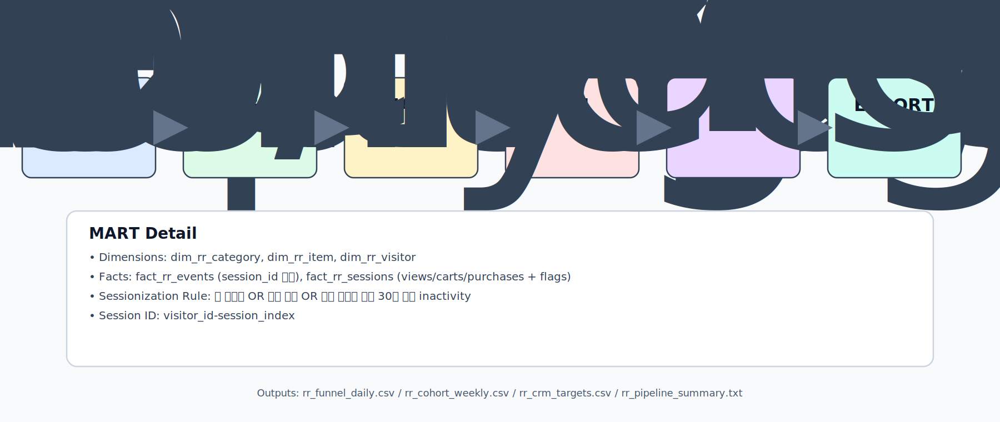
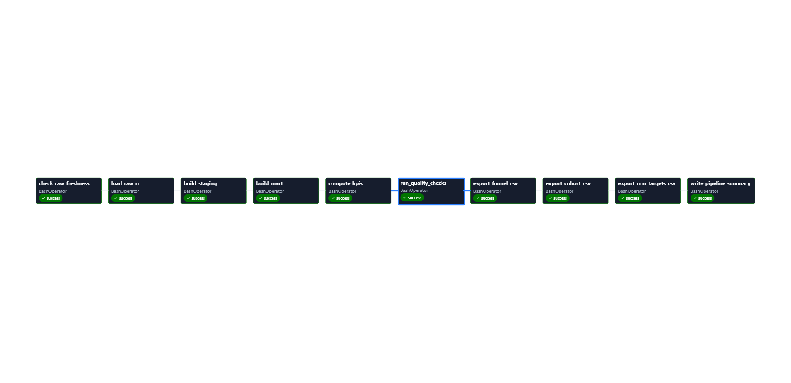
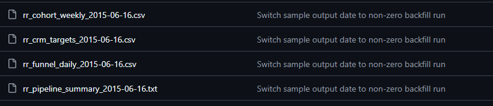

# RetailRocket Funnel·Cohort·CRM KPI Pipeline + QA

RetailRocket clickstream으로 **퍼널·코호트·CRM 타겟**을 산출하는 Airflow 파이프라인입니다.  
핵심은 배치 성공이 아니라, **지표 정의·세션 기준·품질 검증**을 고정해 같은 데이터에서 같은 KPI가 나오게 만드는 것입니다.

<div class="hero-callout">
  <p class="hero-label">Core Principle</p>
  <p class="hero-math">$$Batch\ Success \neq Data\ Trust$$</p>
  <p class="hero-desc">배치 성공과 데이터 신뢰는 다르다는 전제로 QA 게이트를 설계했습니다.</p>
</div>

---

## 1) 문제와 목표

CVR 급락 알림이 오면 보통 캠페인/예산 조정을 먼저 논의합니다.  
하지만 세션 기준, 전환 정의, `transaction_id` 무결성이 흔들리면 같은 로그에서도 결론이 달라질 수 있습니다.

핵심 리스크:

- 세션 기준 변화로 CVR 해석이 달라질 수 있음
- `transaction_id` 누락/중복으로 구매·매출 지표 왜곡 가능
- 배치 success만으로는 도메인 오류·결측·중복 전파를 막기 어려움
- 결과를 실행 형식(타겟 리스트/요약 리포트)으로 정리하지 않으면 후속 액션이 지연될 수 있음

프로젝트 목표는 위 리스크를 줄이기 위해,  
**지표 정의·세션 기준·품질 검증을 고정하고 QA를 통과한 결과만 운영 산출물로 전달하는 파이프라인을 구축하는 것**입니다.

---

## 2) 데이터셋

이 데이터는 clickstream 이벤트가 풍부해 세션화·퍼널·코호트·CRM 과정을 end-to-end로 검증하기 적합합니다.  
공개 데이터라 재현 가능한 형태로 분석 결과를 공유하기 좋습니다.

- 출처: Kaggle RetailRocket eCommerce Dataset  
  https://www.kaggle.com/datasets/retailrocket/ecommerce-dataset
- 로컬 경로: `data/raw/retailrocket/`
- 이벤트 기간: `2015-05-03 ~ 2015-09-18 (KST)`

| 파일 | 규모 (행 × 열) | 주요 컬럼 |
|---|---:|---|
| `events.csv` | 2,756,101 × 5 | `timestamp, visitorid, event, itemid, transactionid` |
| `category_tree.csv` | 1,669 × 2 | `categoryid, parentid` |
| `item_properties_part1.csv` | 10,999,999 × 4 | `timestamp, itemid, property, value` |
| `item_properties_part2.csv` | 9,275,903 × 4 | `timestamp, itemid, property, value` |

EDA 참고:
- 요약 문서: [docs/retailrocket_eda.md](https://github.com/GeonYul2/DA-AIRFLOW_RETAILROCKET/blob/main/docs/retailrocket_eda.md)
- 재생성 스크립트: `python3 scripts/profile_retailrocket_eda.py`

---

## 3) 파이프라인 설계와 구현

<figure>
  
  <figcaption>RAW → STAGING → DATA MART → KPI → QA → EXPORT</figcaption>
</figure>

| 단계 | 목적 | 이 단계에서 한 일 |
|---|---|---|
| RAW | 원본 보존과 추적 기준 확보 | CSV 원본을 그대로 적재해 원천 로그를 보존하고, 이후 단계와 분리해 재처리 기준을 고정 |
| STAGING | 전처리 편차 제거 | 이벤트 타입 정규화, 시간 변환(`timestamp_ms → event_ts/event_date`), 아이템 최신 속성 스냅샷, 카테고리 트리 평탄화 |
| DATA MART | 분석 단위 통일 | dim/fact 구조로 분리하고 세션 규칙(30분 inactivity + 날짜 변경)을 SQL로 고정 |
| KPI | 지표 계산 일관성 확보 | Funnel/Cohort/CRM 계산을 별도 테이블로 분리해 분자/분모 정의를 단일화 |
| QA | 품질 기준 선반영 | domain / integrity / null / rowcount / KPI range(0~1) 5개 체크를 실행 조건으로 적용 |
| EXPORT | 실행 가능한 전달물 생성 | QA 통과 시에만 CSV 3종 + summary TXT 1종을 고정 파일명 패턴으로 생성 |

<details>
<summary><strong>워크플로우 상세 (RAW → STAGING → DATA MART → KPI → QA → EXPORT)</strong></summary>

### RAW — 원본 보존
- **왜 필요한가**: 원본이 바뀌면 원인 추적이 어려워집니다.
- **어떻게 했나**: `events.csv`, `item_properties*.csv`, `category_tree.csv`를 그대로 적재하고 이후 레이어와 분리했습니다.
- **관련 코드**
  - 적재 스크립트: `scripts/load_raw/load_retailrocket.py`
  - DDL: `sql/retailrocket/00_ddl/001_create_tables.sql`

### STAGING — 형식 표준화
- **왜 필요한가**: 타입/시간/속성 포맷 차이로 집계 편차가 발생합니다.
- **어떻게 했나**
  - 이벤트 타입 허용값(`view/addtocart/transaction`) 정규화
  - `timestamp_ms`를 `event_ts`, `event_date`로 변환
  - item property 최신값 스냅샷화
  - 카테고리 트리 평탄화
- **관련 SQL**
  - `sql/retailrocket/10_staging/001_stg_rr_events.sql`
  - `sql/retailrocket/10_staging/002_stg_rr_item_snapshot.sql`
  - `sql/retailrocket/10_staging/003_stg_rr_category_dim.sql`

### DATA MART — 분석 단위 고정
- **왜 필요한가**: 세션 기준이 바뀌면 CVR 해석이 달라집니다.
- **어떻게 했나**
  - visitor별 시간순 정렬 후 세션 경계 규칙 SQL 고정
  - 세션 시작 조건: 첫 이벤트 / 날짜 변경 / 30분 초과 간격
  - 세션 ID(`visitor_id-session_index`) 기반 집계
- **관련 SQL**
  - `sql/retailrocket/20_mart/010_fact_rr_events.sql`
  - `sql/retailrocket/20_mart/020_fact_rr_sessions.sql`

### KPI — 정의 고정
- **왜 필요한가**: KPI는 값보다 분자/분모 정의가 중요합니다.
- **어떻게 했나**
  - Funnel(일 단위): `cvr_session_to_purchase = sessions_with_purchase / sessions`
  - Cohort(주 단위): `retention_rate = active_visitors / cohort_size`
  - CRM Targets(일 단위): 장바구니 이탈자 / 고의도 조회자(7일) / 반복구매자
- **관련 SQL**
  - `sql/retailrocket/30_kpi/001_mart_rr_funnel_daily.sql`
  - `sql/retailrocket/30_kpi/003_mart_rr_cohort_weekly.sql`
  - `sql/retailrocket/30_kpi/004_mart_rr_crm_targets_daily.sql`

### QA — 품질 게이트
- **왜 필요한가**: DAG success가 데이터 신뢰를 보장하지 않습니다.
- **어떻게 했나**: 5개 품질 체크를 모두 통과한 경우에만 EXPORT로 진행합니다.

### EXPORT — 실행 가능한 전달물
- **왜 필요한가**: 분석 결과가 실행 포맷이어야 후속 액션이 빨라집니다.
- **어떻게 했나**: QA 통과 실행에서만 CSV 3종 + summary TXT 생성
- **관련 스크립트**
  - `scripts/export_rr_funnel_csv.py`
  - `scripts/export_rr_cohort_csv.py`
  - `scripts/export_rr_crm_targets_csv.py`
  - `scripts/write_rr_pipeline_summary.py`

</details>

---

## 4) QA Gate — 선정 근거와 테스트 케이스

### 4-1. QA 5종 선정 근거

프로젝트 진행 중 “배치는 성공했는데 KPI는 틀릴 수 있는 상황”을 먼저 정의했고, 그 상황을 막기 위한 최소 검증 세트로 QA 5종을 설계했습니다.

<div class="table-wrap" markdown="1">

| 실제로 우려한 상황 | 왜 위험한가 | 설계한 QA |
|---|---|---|
| 이벤트 타입 값이 제각각 들어옴 (`view`/`View`/오타 등) | 이벤트 분류가 깨지면 퍼널 분자/분모가 왜곡됨 | Domain check |
| 구매 이벤트에 `transaction_id`가 비어 있음 | 구매 식별이 불가능해 구매 지표 신뢰가 무너짐 | Transaction integrity |
| 핵심 키(`timestamp_ms`, `visitor_id`, `item_id`, `event_ts`) 결측 | 세션화/조인/집계 단계에서 누락·왜곡 전파 | Null checks |
| STAGING/MART 핵심 테이블이 비정상적으로 0건 | 수집/적재 이상인데 후속 집계가 진행될 수 있음 | Rowcount sanity |
| CVR이 0~1 범위를 벗어나거나 음수 발생 | 계산식/분모 처리 오류가 운영 지표로 배포될 수 있음 | KPI sanity |

</div>

### 4-2. 테스트 케이스 명세

<div class="table-wrap" markdown="1">

| Test Case | Given (검증 상황) | 판정 기준 | 실패 시 기대 동작 |
|---|---|---|---|
| TC-01 Domain | `raw_rr_events.event_type` 허용값 외 존재 여부 | <span class="pass">PASS</span>: 결과 0행 | 품질 체크 실패로 DAG 중단, export 차단 |
| TC-02 Integrity | `event_type='transaction' AND transaction_id IS NULL` 존재 여부 | <span class="pass">PASS</span>: 결과 0행 | 품질 체크 실패, 원천/적재 로직 점검 후 backfill |
| TC-03 Null | 핵심 키 NULL 존재 여부 | <span class="pass">PASS</span>: 결과 0행 | 품질 체크 실패, 결측 원인 추적 후 재실행 |
| TC-04 Rowcount | `stg/fact` 핵심 테이블 0건 여부 | <span class="pass">PASS</span>: 결과 0행(=모두 1건 이상) | 품질 체크 실패, 적재/마트 단계 상태 점검 |
| TC-05 KPI Sanity | target_date KPI 값의 음수/범위 이탈 여부 | <span class="pass">PASS</span>: 결과 0행 | 품질 체크 실패, 분모·분자·계산식 점검 |

</div>

`scripts/run_quality_checks.py`는 하나라도 FAIL이면 `exit 1`로 비정상 종료됩니다. 따라서 QA 통과 전에는 CSV/TXT export가 실행되지 않습니다.

---

## 5) 결과와 산출물

대표 재현 실행: `target_date=2015-06-16`

<figure>
  
  <figcaption>Airflow DAG 실행 그래프: 전체 태스크 success (manual backfill)</figcaption>
</figure>

<figure>
  
  <figcaption>QA 통과 후 생성된 산출물(CSV 3종 + summary TXT 1종)</figcaption>
</figure>

결과 요약:

- QA 통과 실행에서만 export 생성
- 실행 1회마다 동일 포맷 산출물 자동 생성
- KPI 계산 로직과 품질 검증 로직 분리로 원인 추적 단순화

핵심 수치(`2015-06-16`):

- Funnel: visitors `4,379`, sessions `4,540`, purchases `67`, `cvr_session_to_purchase=0.0134`
- CRM 분포: `cart_abandoner_today=80`, `high_intent_viewer_7d_no_cart=115`, `repeat_buyer=117`
- QA: `001~005` 모두 `PASS`

---

## 6) 재현 방법

```bash
cp .env.example .env
make up
make init
make run-dag
```

수동 백필 실행:

```json
{"target_date":"2015-06-16"}
```

기대 산출물:

- `logs/reports/rr_funnel_daily_2015-06-16.csv`
- `logs/reports/rr_cohort_weekly_2015-06-16.csv`
- `logs/reports/rr_crm_targets_2015-06-16.csv`
- `logs/reports/rr_pipeline_summary_2015-06-16.txt`

---

## 7) Future Work

<div class="future-card">
  <h3>AI Quality Agent</h3>
  <p>오늘의집이 지향하는 AI-Native 협업 방식을 가정해, 품질 점검 보조 에이전트 기능을 다음 단계로 설계했습니다.</p>
  <ul>
    <li><strong>Anomaly Explain:</strong> QA 실패 항목을 원인 후보(SQL/테이블/컬럼)로 요약</li>
    <li><strong>Backfill Assist:</strong> 실패 run 기준 재실행 파라미터와 영향 범위 제안</li>
    <li><strong>Trend Watch:</strong> quality_check_runs 기반 실패 추세/재발 패턴 탐지</li>
  </ul>
</div>

---

## 8) 활용 관점

- **BA/그로스**: 캠페인 조정 전에 정의/세션/누락 이슈를 먼저 점검할 수 있습니다.
- **DQA/운영**: 배치 성공과 KPI 신뢰를 분리해 품질 기준으로 운영할 수 있습니다.

핵심 메시지: **숫자를 만드는 파이프라인이 아니라, 숫자를 믿을 수 있게 만드는 파이프라인**

---

- Project Page: https://geonyul2.github.io/DA-AIRFLOW_RETAILROCKET/
- GitHub Repo: https://github.com/GeonYul2/DA-AIRFLOW_RETAILROCKET
- README: https://github.com/GeonYul2/DA-AIRFLOW_RETAILROCKET/blob/main/README.md
